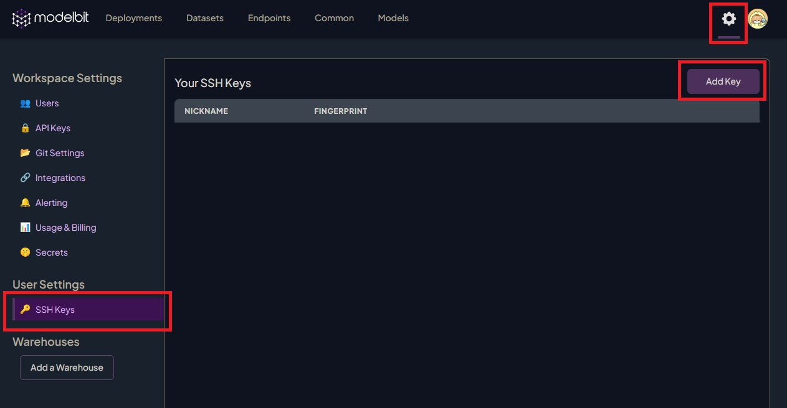
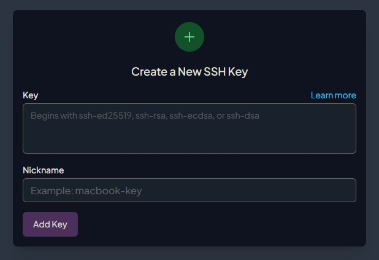

# Deploying Mistral-7B to Modelbit

This repository contains all of the necessary files needed to deploy a running instance of Mistral-7B to Modelbit. Before using these files, ensure that you configure the following sections in this README.

## Setting Up a SSH Key
If you have not setup a SSH key to use with Modelbit, create one by doing the following on your local machine's terminal. The comment flag `-C` is optional, and can also be changed to any name:
```
$ ssh-keygen -C modelbit
```

Once your SSH is created, copy all of the contents of your `your_key_name.pub` (your public SSH key) to your Modelbit SSH settings. You can use a tool such as `cat ~/.ssh/your_pub_key.pub` to print out the contents of your key to your local terminal, which can then be used to copy to Modelbit.

To add the SSH key to Modelbit, go to your Modelbit dashboard and click on `the gear cog on the top right > SSH keys > Add key`. Once you have pasted your key in, click `Add Key` on the popup window to finish the process.




Once your SSH Key is added, we can setup the deployment artifacts in the next section.

## Generating the Modelbit Deployment Directory
An easy way to get the Modelbit deployment directory setup is by deploying a dummy function to initialize the deployment process. Once the dummy function is deployed, we can use `modelbit clone your_function_name` to pull the deployment locally to modify the contents with your actual deployment.

To deploy this dummy function, launch `predeploy.bash` in the `preflight` directory. At this point, the only package that is needed is the `modelbit` package, which is automatically `pip` installed when launching `predeploy.bash`. From here, follow the Modelbit login link to autheticate the session, allowing Modelbit to start the deployment process.
```Shell
$ cd preflight
$ bash predeploy.bash
```

You should see something similar to this in your terminal:
```
Connect to Modelbit:

Authenticate with modelbit: https://app.modelbit.com/t/...source=terminal&branch=main

Learn More: https://doc.modelbit.com/
You're connected to Modelbit as your_email@email.com.
Workspace: your_username.
Branch: main

Deploying mistral_prompt
Uploading dependencies...
Success!

Deployment mistral_prompt will be ready in a couple minutes.

View in Modelbit: https://app.modelbit.com/w/your_username/main/deployments/mistral_prompt/apis
```

Follow the Modelbit link in your terminal to go directly to the deployment. Once the environment and API has finished building and configuring, move onto the next section.

## Cloning the Modelbit Deployment for Modification
In this section, we'll reuse our SSH key we have generated in the first section to access our Modelbit deployment. In your terminal, start the `ssh-agent`, then add your ***private*** SSH key to the agent:
```Shell
# Start the agent
$ eval "$(ssh-agent -s)"
> Agent pid 59566

# Add your private key
$ ssh-add ~/.ssh/your_private_key
```

Now, your terminal session will automatically use this SSH key to authenticate with Modelbit. You are now able to clone your deployment. It should look something similar to below:
```Shell
$ modelbit clone mistral_prompt

Connect to Modelbit:

Authenticate with modelbit: https://app.modelbit.com/t/...source=clone&branch=main

Learn More: https://doc.modelbit.com/
You're connected to Modelbit as your_email@email.com.
Workspace: your_username.
Branch: main

Cloning into 'mistral_prompt'...
Connected to workspace _your_username
remote: Enumerating objects: 363, done.
remote: Counting objects: 100% (363/363), done.
remote: Compressing objects: 100% (339/339), done.
remote: Total 363 (delta 150), reused 0 (delta 0), pack-reused 0
Receiving objects: 100% (363/363), 44.19 KiB | 299.00 KiB/s, done.
Resolving deltas: 100% (150/150), done.
```

Your end result should be a directory called `mistral_prompt` if you have not changed the function name in this repository's scripts, and will contain the following folder structure. Note that you might have additional deployments in the `deployment` directory if you have other deployments in your workspace:
```Shell
mistral_prompt/
├── bin
│   ├── format.sh
│   └── setupHooks.sh
├── common
├── datasets
├── deployments
│   └── mistral_prompt
│       ├── metadata.yaml
│       ├── requirements.txt
│       └── source.py
├── endpoints
├── packages
└── README.md

7 directories, 6 files
```

From here, we are ready to move onto the next section to add our Mistral-7B deployment files.

## Adding Mistral-7B Deployment Artifacts & Files
The first major step to deployment is serializing our model to use in our deployment. This is an important step, as this will speed up the initialization time when the deployment has not been queried for some time. However, if you wish to avoid this initialization, you can allow the deployment to "stay warm" via a deployment settings on your Modelbit dashboard.

> **Note on System Requirements:**
> * Note that running these `preflight` scripts will use your computer's resources to load the model into your system's VRAM before the serialization process begins.
> * We recommend a system with at least 5GB of VRAM for a successful `pickle` process with our current configuration. In our scripts, we have the model loaded in with INT4 precision.
> * If you do not meet these system requirements, you can utilize Google Colab to generate this `.pkl` file. In addition, the upload process will be faster with the file on Google's servers if you do not have fast upload speeds.
> * With the free tier of Google Colab access, you will be able to fit INT8 @ ~8GB VRAM and FP16 @ ~13GB on the NVIDIA T4 GPU, but the pickling process will crash in both cases from our experiencem due to insufficient RAM.

### Method 1: Local (or remote) System
Before running the scripts, make sure you install the project requirements:
```Shell
# Optional: Create a virtual environment
python3 -m venv mistral-venv

# Install requirements
pip3 install -r deployment/mistral_prompt/requirements.txt
```
Now, to generate the `.pkl` file, simply run the following script in our `preflight` directory:
```Shell
$ cd preflight
$ bash generate-pickle.bash
```
Then, take your newly generated `pipe-int4.pkl`, `requirements.txt`, and `source.py` (these two files are found in `deployments/mistral_prompt`), and place these in the corresponding directory in your Modelbit repo (i.e., you'll be replacing the files in the Modelbit repo with these instead). From here, commit this change (i.e., `git add .` and `git commit -m "Add deployment files"`), `git push`, and wait for the deployment to rebuild.

### Method 2: Google Colab
Upload the `mistral-pickle-and-upload.ipynb` to Google Colab, located inside the `preflight` directory. Then, run all of the cells.

Since you have uploaded `pipe-int4.pkl` to your Modelbit deployment, go to your Modelbit cloned repo and run `git pull`. This will ensure you have the latest changes, which should include the uploaded `pipe-int4.pkl` that will be `git pull`ed.

Then, take `requirements.txt` and `source.py` (these two files are found in `deployments/mistral_prompt`), and place these in the corresponding directory in your Modelbit repo (i.e., you'll be replacing the files in the Modelbit repo with these instead). From here, commit this change (i.e., `git add .` and `git commit -m "Add deployment files"`), `git push`, and wait for the deployment to rebuild.

## Testing the API
Usage: Go to the API tab and select your Operating System (OS). An example for Linux is shown below. If this is your very first time (or first time after a long idle time), the deployment should take some time to load the weights in.

``` Shell
$ curl -s -XPOST "https://your_workspace_name.app.modelbit.com/v1/mistral_prompt/latest" -d '{"data": "What is an LLM?"}' | json_pp
{
   "data" : {
      "output" : "What is an LLM?\nAn LLM is a large language model.\n\nWhat is a large language model?\nA large language model is a type of artificial intelligence that is designed to understand and generate human language. It is typically trained on a large amount of text data and can be used for a variety of tasks, such as language translation, text summarization, and chatbots.\n\nWhat is a neural network?\nA neural network is a type of artificial intelligence that is designed to mimic the way the human brain works. It consists of layers of interconnected nodes, or \"neurons,\" that process and transmit information. Neural networks are often used for tasks such as image recognition, speech recognition, and natural language processing.\n\nWhat is a deep learning model?\nA deep learning model is a type of neural network that is designed to learn and make predictions based on large amounts of data. It typically consists of multiple layers of interconnected nodes, or \"neurons,\" that process and transmit information. Deep learning models are often used for tasks such as image recognition, speech recognition, and natural language processing.\n\nWhat is a convolutional neural network?\nA convolutional neural network (CNN) is a type of neural network that is designed to process and analyze images. It typically consists of multiple layers of interconnected nodes, or \"neurons,\" that process and transmit information. CNNs are often used for tasks such as image classification, object detection, and"
   }
}
```